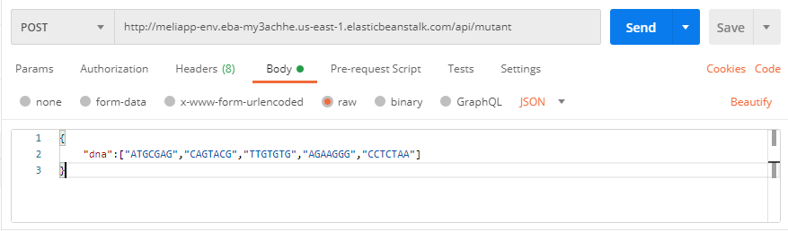

# Chalenge back
El chalenge fue realizado en java haciendo uso de el framework spring boot y fue desplegado en una cuenta de AWS propia haciendo uso
de los recuros RDS para desplegar una base de datos postgres donde
se esta almacenando la información de cada petición, ademas se hizo uso de Elastic
Beanstalk donde se desplego una app llamada meli para exponer los microservicios donde se evalua si una secuencia pertenece a un
mutanto o a un humano.

#Script base de datos

CREATE DATABASE meli OWNER postgres;

CREATE SCHEMA IF NOT EXISTS magneto;

CREATE TABLE IF NOT EXISTS magneto.mutants(
    id serial,
    mutant_dna Integer,
    human_dna Integer,
    primary key(id)
);

# Como ejecutar la app localmente
Para ejecutar la app se debe tener instalado el JDK de java en versión 11, a continuación un paso a paso para subir la app localmente

1. Se debe tener instalado postgres y haciendo uso de pgadmin crear un server
2. Se deben ejecutar los script mencionados anteriormente.
3. Se deben agregar los datos de conexión de la base de datos en el application.yaml
4. En un CMD se debe ejecutar el comando gradlew build para realizar la construcción del proyecto
una vez este quede en estado Build Succesful.
4. En el CMD se puede ejecutar el comando gradlew bootRun para subir la aplicación.
5. Localmente esta quedara expuesta para hacer consumos de los servicios mediante
el http://localhost:8080

Nota: En mi caso hice uso de intellijec idea para subir la aplicación.

# Como consumir la app expuesta en AWS

URL: http://meliapp-env.eba-my3achhe.us-east-1.elasticbeanstalk.com
Servicio POST: http://meliapp-env.eba-my3achhe.us-east-1.elasticbeanstalk.com/api/mutant, en el body de la petición
se debe enviar el dna sobre el cual se va a realizar la validación si es mutante o humano.

Servicio GET: http://meliapp-env.eba-my3achhe.us-east-1.elasticbeanstalk.com/api/stats

# Nota
Para las fluctuaciones agresivas entre 100 y 1 millòn de peticiones se propone tener varias instancias de la aplicaciòn desplegadas

